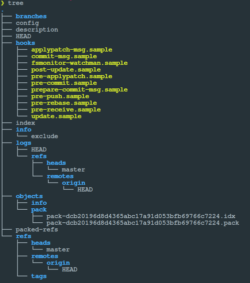
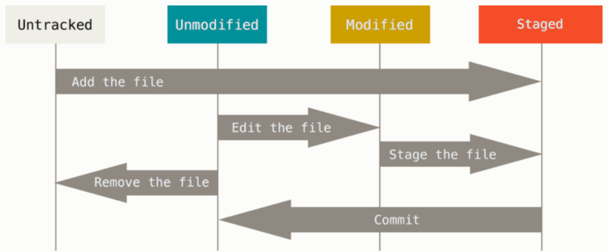

# Git básico e atual

## Nivelamento em Git


### Grupo de Estudos do PUG-PB

* Hildeberto (hildeberto@gmail.com)

---

### Abrace as mudanças

* A forma viva dos escritos é o rascunho

* Não costumamos enxergar a gradação e evolução numa obra acabada (mas elas estão lá)

* Não se apegue demais ao que escreve (tudo flui)

---

### Tome decisões com segurança

* Teste antes de distribuir

* Conserve a possibilidade de reversão

* Comprometimento com uma estabilidade temporária

* Adesão máxima possível ao projeto

---

### Controle efetivo de mudanças com Git

* O objetivo é a fácil recuperação em caso de erros ou perda de arquivos

* Os meios:

  * histórico e documentação das mudanças
  * comparação de diferenças
  * desfazer alterações

* Instalação: <https://www.git-scm.com/downloads>

---

### Terminologia (I)

* Repository (repositório): Uma pasta que armazena metadados, arquivos e pastas do código

* Commit (envio, entrega): Mensagem que explica a alteração feita no código

* Branch (ramo, galho): Uma versão obtida a partir do repositório principal ou de outra ramificação, cujas alterações não refletem imediatamente na origem

---

### Terminologia (II)

* Clone: Cópia, duplicação de um repositório

* Index (índice, sumário): Um arquivo do repositório que armazena informação sobre o que poderá ser seu próximo commit (Staging Area/Index)

* Push (empurrar): Transferir arquivos de um repositório local para outro repositório (local ou remoto)

* Pull (puxar, extrair): Trazer as últimas mudanças para o repositório (local ou remoto).

---

### Configuração inicial

```git config```

* [path]/etc/gitconfig: valores aplicados a todos os usuários. Se a opção `--system` for passada ao comando. Necessário privilégio de superusuário.

* ~/.gitconfig OU ~/.config/git/config: valores específicos para o usuário conectado. Se a opção `--global` for passada ao comando.

* .git/config: valores específicos para o repositório. Se a opção `--local` for passada ao comando.

---

### Comandos (I)

* configurar opções do Git

```shell
git config --system http.proxy "https://localhost:2033"
git config --global user.name "Hildeberto"
git config --global user.email "hildeberto@gmail.com"
git config --local --add user.name "Outronome"
git config --global init.defaultBranch main
git config --global alias.st 'status'
```

* criar repositório no diretório corrente (.git/)

```shell
git init
```

* clonar repositório existente

```shell
git clone <caminho local ou endereço na rede> [nome opcional]
git remote -v
```

---

### O que há por baixo dos panos



---

### O que há por baixo dos panos (I)

* O Repositório é uma pasta
  * Sistema de arquivos "paralelo" ao do SO
  * Metadados e objetos
  * Integridade (hash)
  * Dados sempre incluídos (não há exclusão)

---

### Estados dos arquivos



---

### Comandos (II)

* verificar situação do repositório

```shell
git help 
git status
```

* incluir arquivo ao rastreio

```shell
git add pasta/arquivo.ext
git add .
```

* confirmar criação do snapshot

```shell
git commit -m “Commit inicial do projeto”
git log
```

---

### O que há por baixo dos panos (II)

* Snapshots de seu projeto (commits)


---

### .gitignore

* o que nunca deve ser rastreado pelo repositório
  * *.bak
  * *~
  * output/
  * __pycache__/
  * arquivo_que_nao_quero.txt

* Automatizando com API : <https://www.gitignore.io>

---

### O que há por baixo dos panos (III)

* Quase todas as operações são locais
* Naturalmente distribuído (repositório remoto)


---

### Fluxo de trabalho

* Atualizar repositório local (opcional)
* Criar ou ativar um "branch"
* Modificar arquivos
* Adicionar as mudanças para área "stage"
* Realizar um commit, com os arquivos da área "stage", armazenando os "snapshots" no diretório Git.
* Enviar o branch das mudanças para um repositório "principal"

---

### Comandos (III)

```shell
git pull
git switch -c minha_mudanca
git add meu_arquivo.py
git diff meu_arquivo.py
git commit -m "Mudança realizada"
git push origin minha_mudanca
git switch main
git pull
```

* Dependendo do gerenciador remoto (Github, Gitlab, etc), a conclusão se dará com uma solicitação ("pull request", "merge request", etc) para integrar a branch com o código principal.

---

### Trabalho em equipe

* Repositório "principal" remoto (`git remote -v`)
* Branches: cópia completa do projeto, que pode ser editada, evoluída e reconectada
* HEAD: a última revisão (versão) de um branch
* normalmente, coexistem versões de produção, manutenção e desenvolvimento
* merge e/ou rebase: juntar os códigos de vários desenvolvedores que trabalham no mesmo projeto

---

### Comandos (IV)

```shell
git fetch
git merge

git restore --source <hash>
git rebase -i
git stash

git tag
git reset <hash>
```

---

### Para aprender Git

Guia de referência: <https://git-scm.com/docs>

Pro Git: <https://git-scm.com/book/en/v2>

Tutorial: <https://www.atlassian.com/git>

---

### Para aprender Git (pt-br)

Cursos em vídeo: <https://www.udemy.com/git-e-github-para-iniciantes/> e <https://www.udemy.com/git-e-github/>

Tutorial: <https://rogerdudler.github.io/git-guide/index.pt_BR.html>

Git-it (tutorial guiado): <https://github.com/jlord/git-it-electron>

Folha de dicas:
<https://github.github.com/training-kit/downloads/pt_BR/github-git-cheat-sheet/>

Prática, prática, prática...

---

### Serviço git na web

* Github, Bitbucket, Gitlab, Gogs, etc.
* Uso gratuito para projetos de código aberto
* Funcionalidades extras com vistas à colaboração
* Maior base de códigos abertos da Internet
  * Google, IBM, Facebook, Spotify, Twitter, etc
* Fork
* Clone
* Pull request
* Issues

---

### Benesses do código aberto

* Ler código é a melhor forma de aprender
* Mostrar código pode ser diferencial na contratação
* Aprender a trabalhar colaborativamente
* Código bom é gradativo e evolutivo
* Proteção contra mal-intencionados
* Colaboração em prol da comunidade

---

### Para aprender GitHub

* Github guides: <https://guides.github.com>

* Github Essentials (PacktPub e-book):
<https://www.packtpub.com/packt/offers/free-learning/>

* Desktop App for Learning Git and GitHub (trad. pt_br):
<https://github.com/jlord/git-it-electron>

* Contribua, contribua, contribua...

---

### Como contribuir

* Guia geral: <https://opensource.guide/pt/>
* Lista de projetos: <http://issuehub.io>
* Regras (conduta, estilo, etc) em cada projeto
* Código, sim:
  * desenvolver novas capacidades (issues)
  * resolver bugs (issues)
  * melhorar testes automatizados

---

### Como contribuir mais

* escrever e melhorar documentação
* escrever exemplos e tutoriais
* traduzir (documentação, aplicação)
* sugerir mudanças (layout, design, conteúdo)
* responder questões dos “novatos”

---

### Mais algumas referências

<https://woliveiras.com.br/posts/contribuindo-para-projetos-open-source-no-github-mesmo-sendo-iniciante/>

<http://nvie.com/posts/a-successful-git-branching-model/>

<https://gist.github.com/rogeriopradoj/9c2208b50bcb1f047d19>

<https://imasters.com.br/desenvolvimento/como-contribuir-com-um-projeto-no-github/>

---

### Perguntas?


